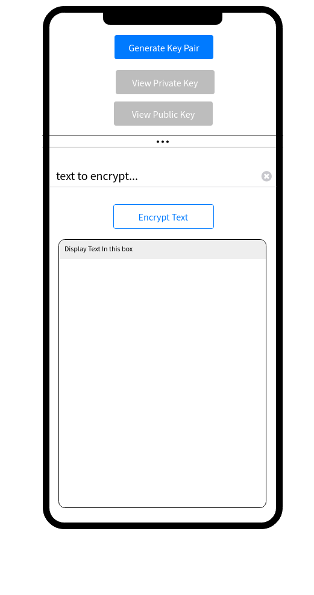

# Encryption
1. clone this repo
2. create a new branch `yourName-solution`
3. Write a one screen Flutter app that encrypts a user given text 
4. Submit a PR into master with your solution



**Requirements**

- The `Generate Key Pair` button should generate a proper [RSA Key Pair](https://en.wikipedia.org/wiki/RSA_(cryptosystem))
- The `View Private Key` and `View Public Key` buttons should display the private key in the `Display Text Box` in [`PEM Key Format`](https://en.wikipedia.org/wiki/Privacy-Enhanced_Mail)

Ex:
```
-----BEGIN PUBLIC KEY-----
MIGfMA0GCSqGSIb3DQEBAQUAA4GNADCBiQKBgQDMYfnvWtC8Id5bPKae5yXSxQTt
+Zpul6AnnZWfI2TtIarvjHBFUtXRo96y7hoL4VWOPKGCsRqMFDkrbeUjRrx8iL91
4/srnyf6sh9c8Zk04xEOpK1ypvBz+Ks4uZObtjnnitf0NBGdjMKxveTq+VE7BWUI
yQjtQ8mbDOsiLLvh7wIDAQAB
-----END PUBLIC KEY-----
```

- The `text to encrypt` field should accept max 60 characters long. 
- The `Encrypt Text` button should encrypt the given text and display the encrypted text in the `Display Text Box`
- The private key pair should be saved to `Shared Preferences` on initial creation
- On app restart, if Key Pair is present in `Shared Preferences`, the `Generate Key Pair` button should be disabled and Key Pairs should be restored
- Use any libraries you want

## Bonus
Generate a random `String` and use this to encrypt the private key itself. How can you recover the private key if the device is lost?